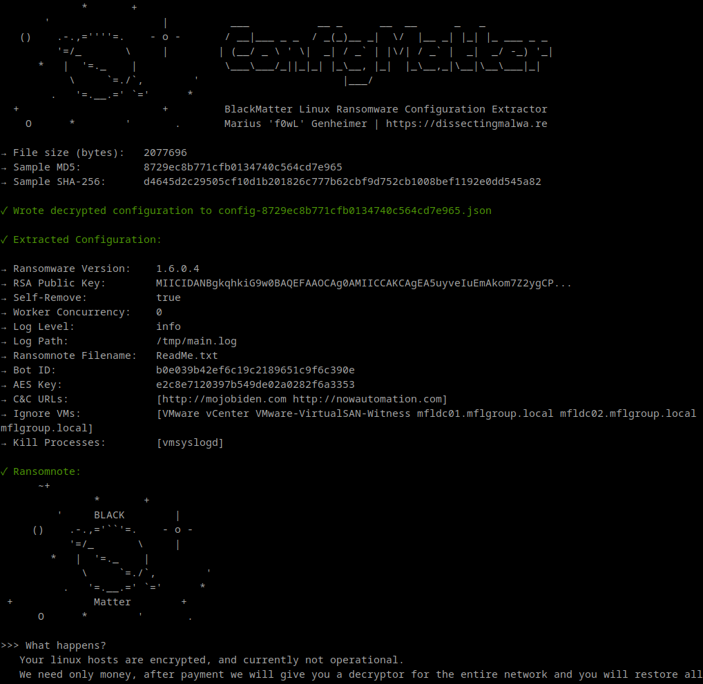
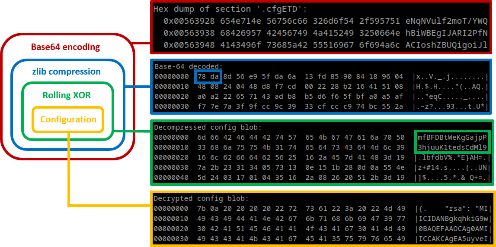

# ConfigMatter-linux

ConfigMatter-linux is a static configuration extractor implemented in Golang for BlackMatter Ransomware (targeting GNU/Linux and VMware ESXi). By default the script will print the extracted information to stdout (using the ```-v``` (verbose) or ```-d``` (debug) flag is recommended for deeper investigations (hexdump, debug information in case of errors). It is also capable of dumping the malware configuration to disk as a JSON file with the ```-j``` flag.

### Usage 

```shell
go run configmatter-linux.go blackmatter-linux_structs.go [-v] [-d] [-j] path/to/sample.elf
```
### Screenshots



## Configuration structure

The configuration of BlackMatter is stored as a Base64 string in the ```.cfgETD``` section for the encryptor and ```.cfgDTD``` for the decryptor. The next layer is zlib compression (the Windows version uses APlib). Once it is decompressed you will be presented with a rolling XOR encryption where the first 32 bytes of the data are the key.



## Testing

This configuration extractor has been tested successfully with the following samples:

|                             SHA-256                              |                     Sample                              |
| :--------------------------------------------------------------: | :-----------------------------------------------------: |
| 1247a68b960aa81b7517c614c12c8b5d1921d1d2fdf17be636079ad94caf970f | [VirusTotal](https://www.virustotal.com/gui/file/1247a68b960aa81b7517c614c12c8b5d1921d1d2fdf17be636079ad94caf970f) |
| 6a7b7147fea63d77368c73cef205eb75d16ef209a246b05698358a28fd16e502 | [VirusTotal](https://www.virustotal.com/gui/file/6a7b7147fea63d77368c73cef205eb75d16ef209a246b05698358a28fd16e502) |
| e48c87a1bb47f60080320167d73f30ca3e6e9964c04ce294c20a451ec1dff425 | [VirusTotal](https://www.virustotal.com/gui/file/e48c87a1bb47f60080320167d73f30ca3e6e9964c04ce294c20a451ec1dff425) |
| d4645d2c29505cf10d1b201826c777b62cbf9d752cb1008bef1192e0dd545a82 | [VirusTotal](https://www.virustotal.com/gui/file/d4645d2c29505cf10d1b201826c777b62cbf9d752cb1008bef1192e0dd545a82) |

If you encounter an error with ConfigMatter, please file a bug report via an issue. Contributions are always welcome :)
